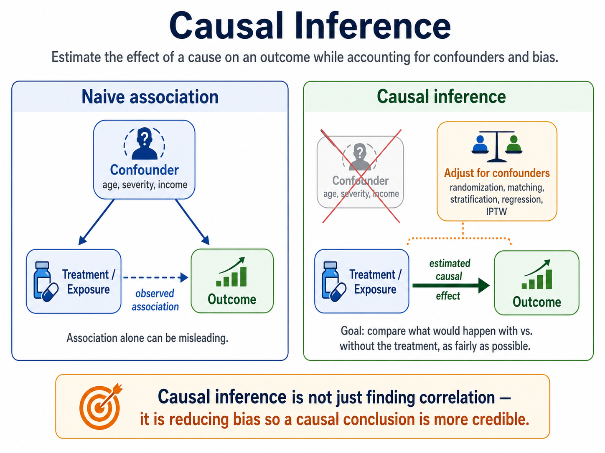
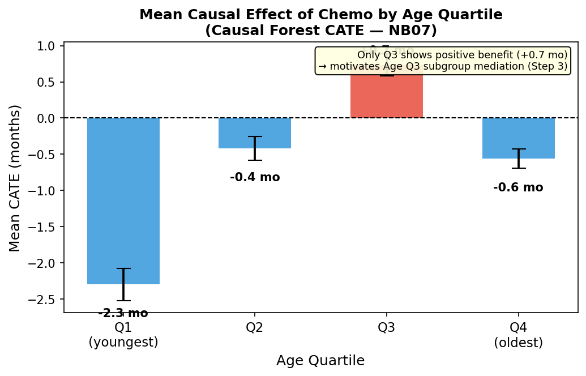
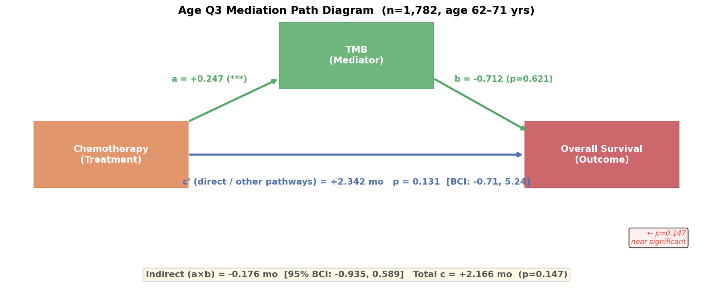

# Causal Inference in Oncology: TCGA Pan-Cancer Atlas

[](https://www.python.org/downloads/)
[](LICENSE)
[](https://jupyter.org/)

> **Question**: Does chemotherapy causally improve survival — and how much of that benefit is mediated through tumour mutation burden (TMB)?

Nine Jupyter notebooks apply complementary causal inference methods to **6,568 real patients** from the TCGA Pan-Cancer Atlas 2018.



---

## At a Glance

### Step 1 — Understand the survival landscape and the two key confounders


Three Kaplan-Meier panels that introduce the two key confounders before any causal adjustment:

- **Left — Naive KM**: chemo patients (red) survive *worse* than no-chemo patients (blue). This is **indication bias** — sicker, later-stage patients are preferentially given chemotherapy, so the raw gap reflects disease severity, not treatment harm.
- **Middle — KM by Stage**: Stage I patients (green) survive far longer than Stage IV (red). Stage is the dominant confounder: it drives both who receives chemo and how long they survive.
- **Right — KM by Age Quartile**: survival decreases monotonically from Q1 (youngest, blue) to Q4 (oldest, purple). Age is a secondary confounder — older patients have worse baseline prognosis and also differ in chemo assignment.

Introducing both confounders here motivates Step 2: after causal adjustment, *which age group actually benefits from chemotherapy?*

---

### Step 2 — Who benefits? Causal Forest identifies Age Q3 as the high-benefit subgroup



A **Causal Forest** (NB07) estimates a personalised treatment effect (CATE) for every patient. After causal adjustment for the confounders shown in Step 1, slicing by age quartile reveals a striking reversal: **only Q3 patients (~57–70 yrs) show a positive mean causal effect (+0.7 months)**; the youngest (Q1) and oldest (Q4) — whose raw KM curves looked better — both have negative estimates.

- **Q1 (youngest)**: disease biology may respond differently; less advanced disease in this cohort
- **Q3 sweet spot**: old enough for high-risk disease, young enough to tolerate a full chemo dose
- **Q4 (oldest)**: benefit eroded by toxicity, dose reductions, and comorbidities

This flags Age Q3 as the subgroup to interrogate further: *why* do they benefit, and through what mechanism?

---

### Step 3 — Is the survival benefit of chemotherapy in Age Q3 mediated through TMB?



Mediation path diagram for the Age Q3 subgroup (n=1,782, age 62–71 yrs), pre-specified by the Causal Forest in Step 2.

Three key numbers:
- **a = +0.247 (\*\*\*)** — chemo robustly raises TMB (confirmed pathway)
- **b = −0.712 (p=0.621)** — TMB→survival association is **not significant**; TMB does not mediate the benefit
- **Total c = +2.166 mo (p=0.147)** — near-significant total benefit; the BCI [−0.71, 5.24] is mostly positive

The indirect effect (a×b = −0.176 mo) is negligible relative to the direct effect (c' = +2.342 mo), suggesting most of chemo's benefit in Age Q3 operates through pathways other than TMB — direct cytotoxicity, immune activation, or unmeasured mechanisms. Full subgroup comparison across all four groups is in NB08.

> ⚠️ **Synthetic TMB disclaimer**: Real TMB values are not available in the TCGA clinical files used here. TMB is simulated from a biologically motivated but artificial model (`shape = 2.5 + 0.8 × CHEMO`). The a-path significance is therefore **built into the simulation by design**, and the b-path result (b ≈ 0) reflects the absence of any TMB→OS link in the data-generating process — not a real biological finding. These results demonstrate the **methodology** only. Conclusions about TMB as a mediator require real mutation burden data.

---

## Quick Start

```bash
# 1. Set up environment
conda env create -f environment.yml && conda activate causal_multiomics

# 2a. Real TCGA data (recommended)
git clone --no-checkout --depth 1 --filter=blob:none \
    https://github.com/cBioPortal/datahub.git ../datahub
cd ../datahub && git sparse-checkout init --cone
git sparse-checkout set $(git ls-tree HEAD public/ | grep pan_can_atlas | awk '{print $4}' | tr '\n' ' ')
git checkout && cd -
python src/fetch_lfs_clinical.py && python src/build_real_dataset.py

# 2b. Offline alternative
python src/generate_synthetic_data.py

# 3. Open notebooks
jupyter lab notebooks/
```

> If the datahub clone is not a sibling directory:
> `python src/fetch_lfs_clinical.py --datahub /your/path/to/datahub/public`

Full data setup details → [`docs/data_guide.md`](docs/data_guide.md)

---

## The Notebooks

| # | Method | Question answered | Key figure |
|---|--------|-------------------|------------|
| 00 | Survival Analysis Primer | What does the raw survival data look like — and why is naive comparison biased? | `00_km_curves.png` |
| 01 | DAG & Causal Assumptions | Which variables must we adjust for — and which must we not? | `01_causal_dag.png` |
| 02 | Propensity Score Matching | What is the causal effect of chemo after removing measured confounding? | `02_love_plot.png` |
| 03 | Difference-in-Differences | Does a treatment guideline change confirm the PSM finding? | `03_event_study.png` |
| 04 | Mediation Analysis | How much of the benefit operates through TMB? | `04_mediation_analysis.png` |
| 05 | Instrumental Variables | Does the result hold even against *unmeasured* confounders? | `05_iv_vs_ols.png` |
| 06 | Sensitivity Analysis | How much hidden bias would overturn the conclusion? | `06_evalue.png` |
| 07 | Heterogeneous Treatment Effects | Does chemo benefit all patients equally — or only certain subgroups? | `07_cate_distribution.png` |
| 08 | Subgroup Mediation | In the high-benefit subgroup identified by NB07, does TMB mediate the effect? | `08_ageq3_path_diagram.png` |

Read notebooks in order — each builds on the previous.
Figure-by-figure interpretation → [`docs/figures_guide.md`](docs/figures_guide.md)

---

## Data

| Variable | Source |
|----------|--------|
| Age, Stage, Cancer Type, OS | ✅ Real TCGA Pan-Cancer Atlas 2018 (6,568 patients) |
| Chemotherapy | ⚠️ Derived proxy (stage + age logistic model) |
| TMB | ⚠️ Simulated in NB04 (real TMB in `data_mutations.txt`) |

Full variable definitions, limitations, rebuild instructions → [`docs/data_guide.md`](docs/data_guide.md)

---

## Docs

| File | Contents |
|------|----------|
| [`docs/concepts.md`](docs/concepts.md) | Causal inference methods explained — DAGs, PSM, DiD, mediation, IV, sensitivity |
| [`docs/data_guide.md`](docs/data_guide.md) | Data provenance, variables, rebuild instructions |
| [`docs/figures_guide.md`](docs/figures_guide.md) | What each figure shows, how to read it, what a good result looks like |

---

## Repository Structure

```
causal_inference_oncology/
├── notebooks/          # 00–08 in order
├── results/figures/    # 34 generated figures
├── docs/               # concepts, data guide, figures guide
├── data/processed/     # parquet cache (gitignored — rebuild locally)
├── src/
│   ├── fetch_lfs_clinical.py
│   ├── build_real_dataset.py
│   └── generate_synthetic_data.py
├── environment.yml
└── Dockerfile
```

---

## References

- Hernán & Robins (2020). *Causal Inference: What If* — [free PDF](https://www.hsph.harvard.edu/miguel-hernan/causal-inference-book/)
- Pearl (2009). *Causality: Models, Reasoning, and Inference*
- VanderWeele (2015). *Explanation in Causal Inference*
- Rosenbaum & Rubin (1983). The central role of the propensity score. *Biometrika*
- VanderWeele & Ding (2017). The E-value. *Annals of Internal Medicine*
- Davey Smith & Ebrahim (2003). Mendelian randomization. *Int J Epidemiology*

