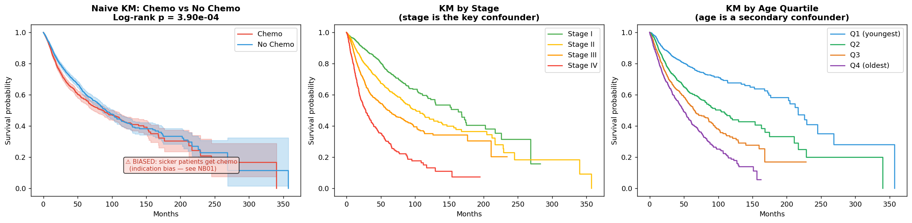
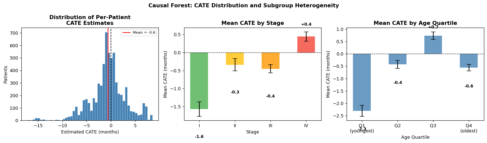

# Causal Inference in Oncology: TCGA Pan-Cancer Atlas

[](https://www.python.org/downloads/)
[](LICENSE)
[](https://jupyter.org/)

> **Question**: Does chemotherapy causally improve survival — and how much of that benefit is mediated through tumour mutation burden (TMB)?

Eight Jupyter notebooks apply complementary causal inference methods to **6,568 real patients** from the TCGA Pan-Cancer Atlas 2018.

---

## At a Glance

### Step 1 — Understand the survival landscape



Kaplan-Meier survival curves stratified by cancer type and chemotherapy status. Each step-down represents a death event; the shaded band is the 95% confidence interval. The gap between the chemo (red) and no-chemo (blue) curves looks encouraging — but this is a **naive comparison**: sicker, later-stage patients are more likely to receive chemotherapy, so the raw difference is confounded. The rest of the repo exists to answer: *what is the real causal effect after removing that bias?*

---

### Step 2 — Estimate who benefits (and by how much)



Results from a **Causal Forest** (NB07), which estimates a personalised treatment effect for every patient — the Conditional Average Treatment Effect (CATE). Three key findings:
- **Left panel**: the distribution of individual CATEs spans a wide range; the red line is the average (≈ the ATE from NB02). Some patients sit near or below zero, suggesting little or no benefit.
- **Middle panel**: mean CATE *increases monotonically with stage* — Stage IV patients gain substantially more survival time from chemo than Stage I patients. This is **effect heterogeneity**: one treatment, very different benefits.
- **Right panel**: younger patients tend to have larger CATEs, consistent with age-related differences in drug tolerance and tumour biology.

This personalised view is only possible because the earlier notebooks established a credible causal estimate to begin with.

---

## Quick Start

```bash
# 1. Set up environment
conda env create -f environment.yml && conda activate causal_multiomics

# 2a. Real TCGA data (recommended)
git clone --no-checkout --depth 1 --filter=blob:none \
    https://github.com/cBioPortal/datahub.git ../datahub
cd ../datahub && git sparse-checkout init --cone
git sparse-checkout set $(git ls-tree HEAD public/ | grep pan_can_atlas | awk '{print $4}' | tr '\n' ' ')
git checkout && cd ../causal_inference_multiomics
python src/fetch_lfs_clinical.py && python src/build_real_dataset.py

# 2b. Offline alternative
python src/generate_synthetic_data.py

# 3. Open notebooks
jupyter lab notebooks/
```

> If the datahub clone is not a sibling directory:
> `python src/fetch_lfs_clinical.py --datahub /your/path/to/datahub/public`

Full data setup details → [`docs/data_guide.md`](docs/data_guide.md)

---

## The Notebooks

| # | Method | Question answered | Key figure |
|---|--------|-------------------|------------|
| 00 | Survival Analysis Primer | What does the raw survival data look like — and why is naive comparison biased? | `00_km_curves.png` |
| 01 | DAG & Causal Assumptions | Which variables must we adjust for — and which must we not? | `01_causal_dag.png` |
| 02 | Propensity Score Matching | What is the causal effect of chemo after removing measured confounding? | `02_love_plot.png` |
| 03 | Difference-in-Differences | Does a treatment guideline change confirm the PSM finding? | `03_event_study.png` |
| 04 | Mediation Analysis | How much of the benefit operates through TMB? | `04_mediation_analysis.png` |
| 05 | Instrumental Variables | Does the result hold even against *unmeasured* confounders? | `05_iv_vs_ols.png` |
| 06 | Sensitivity Analysis | How much hidden bias would overturn the conclusion? | `06_evalue.png` |
| 07 | Heterogeneous Treatment Effects | Does chemo benefit all patients equally — or only certain subgroups? | `07_cate_distribution.png` |

Read notebooks in order — each builds on the previous.
Figure-by-figure interpretation → [`docs/figures_guide.md`](docs/figures_guide.md)

---

## Data

| Variable | Source |
|----------|--------|
| Age, Stage, Cancer Type, OS | ✅ Real TCGA Pan-Cancer Atlas 2018 (6,568 patients) |
| Chemotherapy | ⚠️ Derived proxy (stage + age logistic model) |
| TMB | ⚠️ Simulated in NB04 (real TMB in `data_mutations.txt`) |

Full variable definitions, limitations, rebuild instructions → [`docs/data_guide.md`](docs/data_guide.md)

---

## Docs

| File | Contents |
|------|----------|
| [`docs/concepts.md`](docs/concepts.md) | Causal inference methods explained — DAGs, PSM, DiD, mediation, IV, sensitivity |
| [`docs/data_guide.md`](docs/data_guide.md) | Data provenance, variables, rebuild instructions |
| [`docs/figures_guide.md`](docs/figures_guide.md) | What each figure shows, how to read it, what a good result looks like |

---

## Repository Structure

```
causal_inference_multiomics/
├── notebooks/          # 01–06 in order
├── results/figures/    # 20 generated figures
├── docs/               # concepts, data guide, figures guide
├── data/processed/     # parquet cache (gitignored — rebuild locally)
├── src/
│   ├── fetch_lfs_clinical.py
│   ├── build_real_dataset.py
│   └── generate_synthetic_data.py
├── environment.yml
└── Dockerfile
```

---

## References

- Hernán & Robins (2020). *Causal Inference: What If* — [free PDF](https://www.hsph.harvard.edu/miguel-hernan/causal-inference-book/)
- Pearl (2009). *Causality: Models, Reasoning, and Inference*
- VanderWeele (2015). *Explanation in Causal Inference*
- Rosenbaum & Rubin (1983). The central role of the propensity score. *Biometrika*
- VanderWeele & Ding (2017). The E-value. *Annals of Internal Medicine*
- Davey Smith & Ebrahim (2003). Mendelian randomization. *Int J Epidemiology*

